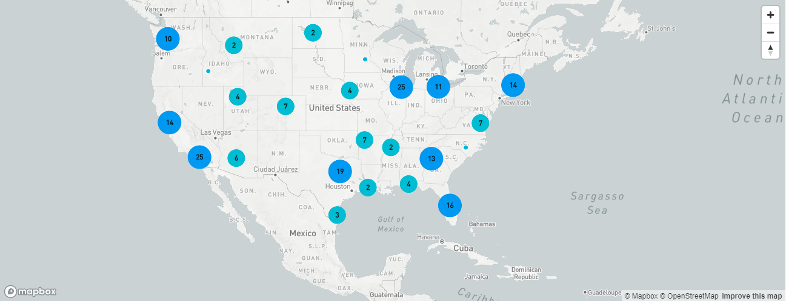

# Yelp Camp

YelpCamp is a website where users can create, view, and review campgrounds.

This project was created using Node.js, Express, MongoDB, and Bootstrap. Passport.js was used to handle authentication.

## Features

- Users can create, edit, and remove campgrounds
- Users can review campgrounds, edit, and delete
- Users can visualize the campgrounds via Mapbox 

## Screenshots

## Demo

https://still-retreat-54304.herokuapp.com/

